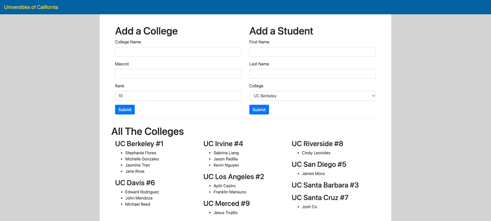
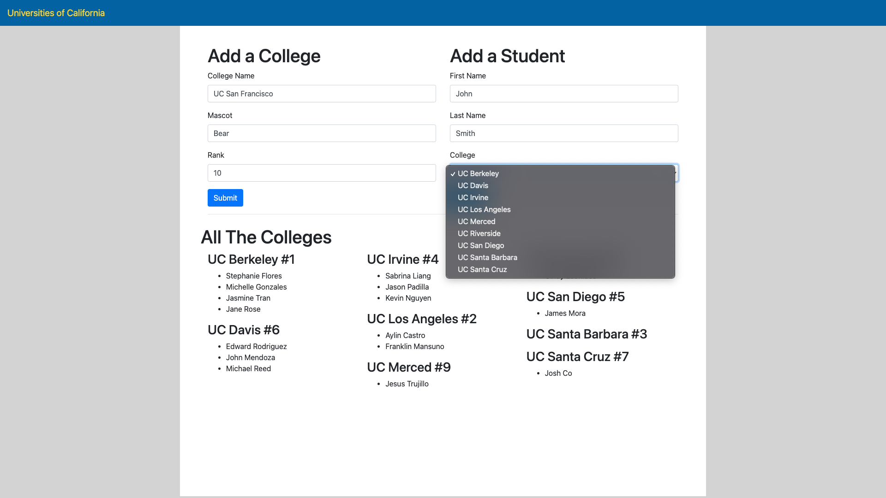

# :computer: Student Colleges
This is a page that shows the universities of california, a user can choose to add more universities or add students that attend a specific university. The universities and the students that are part of each university are stored in Django's sqlite database. Using models and the sqlite database is how the page is able to demonstrate the universities and the students that have been added. When a user is being added a university has to be selected from a dropdown, the dropdown shows the results of all the universities available by pulling all the names from the database beforehand. When a univerity is added, it is placed in order of when it was added but when it is shown on the page it is shown in alphabetical order.  

# :pencil2: What I learned  
  * Django
  * Models
  * Sqlite
  * One to Many

# :camera: Screenshots

